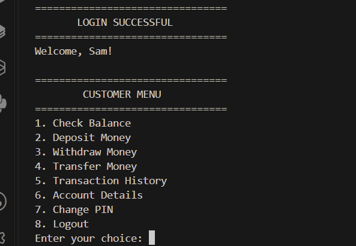
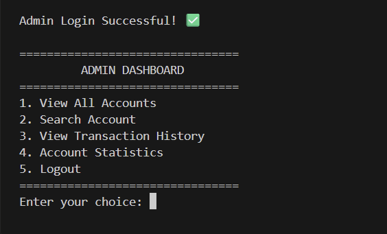

# Banking System Console

A console-based Banking Management System developed using Core Java.
The project demonstrates Object-Oriented Programming, Collections,
Exception Handling, File Handling, and Java Date & Time API.

## Features

- Create new bank accounts
- Customer login with PIN
- Check account balance
- Deposit money
- Withdraw money
- Transfer money between accounts
- View transaction history
- Change account PIN
- Persistent account data using files
- Persistent transaction history
- Admin login
- View all customer accounts
- Search customer account
- View customer transaction history
- View account statistics
- Input validation and exception handling

## Technologies Used

- Java
- Core Java
- Object-Oriented Programming
- ArrayList
- File Handling
- Exception Handling
- Java Date & Time API
- Scanner
- VS Code

## Project Structure

BankingSystem/
│
├── src/
│   ├── Main.java
│   ├── Bank.java
│   ├── Account.java
│   ├── Transaction.java
│   ├── InputValidator.java
│   └── FileManager.java
│
├── data/
│   ├── accounts.txt
│   └── transactions.txt
│
├── out/
│
└── README.md

## How to Run

### 1. Compile

```bash
javac -d out src/*.java

## Screenshots

### Main Menu


### Customer Menu


### Admin Dashboard
